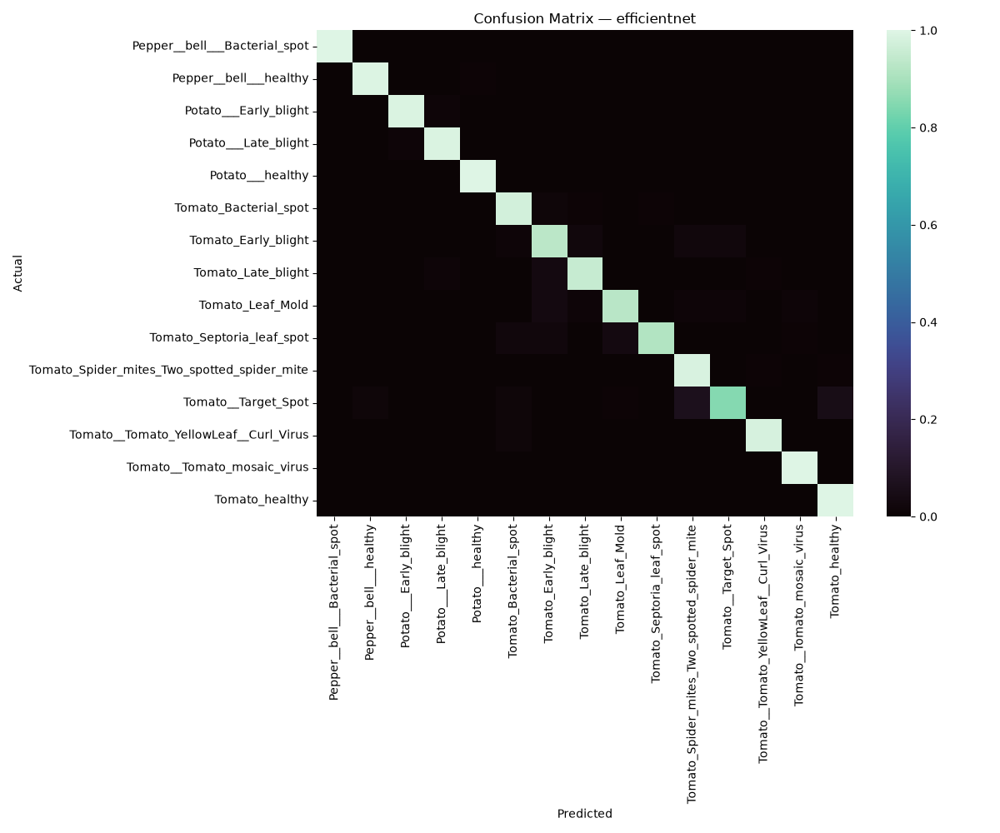
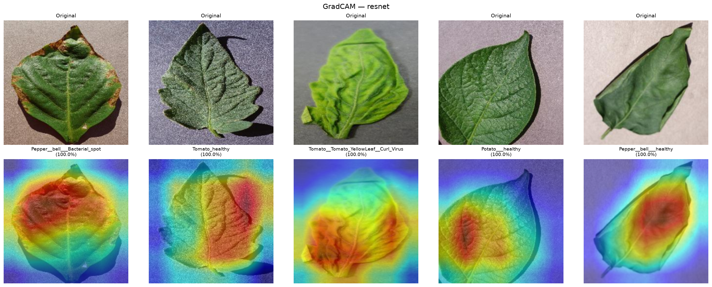
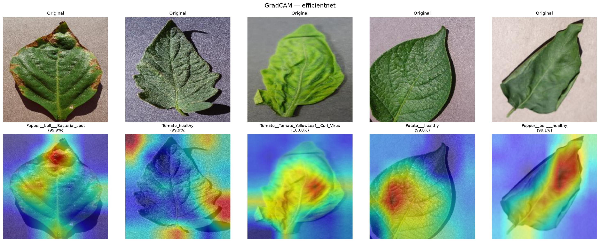

# 🌿 Crop Disease Detector

Fine-tuned **ResNet18** and **EfficientNet-B0** for multi-class crop disease classification, trained on the [PlantVillage](https://www.kaggle.com/datasets/emmarex/plantdisease) dataset — **15 classes** across tomato, potato, and pepper plants. Features a complete transfer-learning pipeline with MLflow experiment tracking, model comparison, GradCAM explainability, and a live Gradio demo with **real-time Grad-CAM heatmaps**.

**[Live Demo](https://huggingface.co/spaces/Naman225/crop-disease-detector)** · **[Dataset](https://www.kaggle.com/datasets/emmarex/plantdisease)**

---

## ✨ Key Features

- **Two-phase transfer learning** — frozen backbone → selective fine-tuning
- **Two architectures compared** — ResNet18 vs EfficientNet-B0
- **MLflow experiment tracking** — all hyperparams, metrics, and artifacts logged
- **GradCAM explainability** — both offline grid analysis and live per-prediction heatmaps in Gradio
- **WeightedRandomSampler** — handles 21× class imbalance without oversampling
- **Disease recommendations** — actionable treatment suggestions for each detected disease

---

## 📊 Results

Two architectures, each trained in two phases — frozen backbone (feature extraction) followed by fine-tuning the last convolutional block — and evaluated once on a held-out test set (2,058 images).

### Model Comparison

| Model | Phase | Test Accuracy | Precision | Recall | F1 |
|:---|:---|:---:|:---:|:---:|:---:|
| ResNet18 | Phase 1 — Frozen backbone | 90.82% | 91.44% | 90.82% | 90.94% |
| ResNet18 | Phase 2 — Fine-tuned (`layer4`) | **99.13%** | **99.13%** | **99.13%** | **99.12%** |
| EfficientNet-B0 | Phase 1 — Frozen backbone | 93.73% | 93.99% | 93.73% | 93.69% |
| EfficientNet-B0 | Phase 2 — Fine-tuned (last block) | 96.36% | 96.48% | 96.36% | 96.35% |

> **ResNet18 (fine-tuned)** was selected as the primary model for deployment based on highest test accuracy (99.13%), with EfficientNet-B0 available as a comparison in the live demo.

### Per-Class Metrics — ResNet18 (Fine-Tuned)

| Class | Precision | Recall | F1-Score | Support |
|:---|:---:|:---:|:---:|:---:|
| Bell Pepper — Bacterial Spot | 100.0% | 100.0% | 100.0% | 99 |
| Bell Pepper — Healthy | 100.0% | 100.0% | 100.0% | 147 |
| Potato — Early Blight | 100.0% | 100.0% | 100.0% | 100 |
| Potato — Late Blight | 98.04% | 100.0% | 99.01% | 100 |
| Potato — Healthy | 100.0% | 100.0% | 100.0% | 15 |
| Tomato — Bacterial Spot | 99.07% | 100.0% | 99.53% | 212 |
| Tomato — Early Blight | 98.96% | 95.00% | 96.94% | 100 |
| Tomato — Late Blight | 98.41% | 97.89% | 98.15% | 190 |
| Tomato — Leaf Mold | 96.91% | 98.95% | 97.92% | 95 |
| Tomato — Septoria Leaf Spot | 100.0% | 98.31% | 99.15% | 177 |
| Tomato — Spider Mites | 98.24% | 100.0% | 99.11% | 167 |
| Tomato — Target Spot | 97.86% | 97.86% | 97.86% | 140 |
| Tomato — Yellow Leaf Curl Virus | 99.69% | 99.69% | 99.69% | 320 |
| Tomato — Mosaic Virus | 100.0% | 100.0% | 100.0% | 37 |
| Tomato — Healthy | 100.0% | 99.37% | 99.68% | 159 |
| **Weighted Average** | **99.13%** | **99.13%** | **99.12%** | **2,058** |

### Per-Class Metrics — EfficientNet-B0 (Fine-Tuned)

| Class | Precision | Recall | F1-Score | Support |
|:---|:---:|:---:|:---:|:---:|
| Bell Pepper — Bacterial Spot | 100.0% | 100.0% | 100.0% | 99 |
| Bell Pepper — Healthy | 98.65% | 99.32% | 98.98% | 147 |
| Potato — Early Blight | 99.00% | 99.00% | 99.00% | 100 |
| Potato — Late Blight | 97.06% | 99.00% | 98.02% | 100 |
| Potato — Healthy | 93.75% | 100.0% | 96.77% | 15 |
| Tomato — Bacterial Spot | 94.95% | 97.64% | 96.28% | 212 |
| Tomato — Early Blight | 84.55% | 93.00% | 88.57% | 100 |
| Tomato — Late Blight | 97.84% | 95.26% | 96.53% | 190 |
| Tomato — Leaf Mold | 91.67% | 92.63% | 92.15% | 95 |
| Tomato — Septoria Leaf Spot | 99.39% | 91.53% | 95.29% | 177 |
| Tomato — Spider Mites | 93.22% | 98.80% | 95.93% | 167 |
| Tomato — Target Spot | 97.54% | 85.00% | 90.84% | 140 |
| Tomato — Yellow Leaf Curl Virus | 99.37% | 98.13% | 98.74% | 320 |
| Tomato — Mosaic Virus | 94.87% | 100.0% | 97.37% | 37 |
| Tomato — Healthy | 95.21% | 100.0% | 97.55% | 159 |
| **Weighted Average** | **96.48%** | **96.36%** | **96.35%** | **2,058** |

### Confusion Matrices

| ResNet18 (Fine-Tuned) | EfficientNet-B0 (Fine-Tuned) |
|:---:|:---:|
|  |  |

Both models show a strong diagonal with minimal cross-class confusion. The weakest-performing class across both models is **Tomato — Early Blight**, which is most often confused with **Tomato — Late Blight** — the two diseases are visually similar in early stages, even to a trained eye.

---

## 🔍 Explainability — GradCAM

GradCAM is integrated at **two levels**:

1. **Offline analysis** — GradCAM grids generated on random test images for each model, saved as artifacts for analysis
2. **Live in Gradio** — every prediction in the demo returns a real-time Grad-CAM heatmap overlaid on the uploaded image, so users can see exactly which regions influenced the model's decision

### Offline GradCAM Grids

| ResNet18 | EfficientNet-B0 |
|:---:|:---:|
|  |  |

**Finding:** Both models attend broadly to overall leaf shape, color, and vein structure rather than precisely localizing disease lesions. This is consistent with a known limitation of PlantVillage — a lab-controlled dataset with clean, isolated leaf images on plain backgrounds. Models trained on it can reach very high accuracy by learning general leaf appearance patterns rather than fine-grained symptom localization.

### Live Grad-CAM in Gradio

The Gradio demo generates a **per-prediction GradCAM heatmap** using the `pytorch-grad-cam` library, targeting:
- **ResNet18** → `layer4` (final residual block)
- **EfficientNet-B0** → `features[-1]` (final convolutional block)

Each prediction returns:
- Top-3 class probabilities
- Grad-CAM heatmap overlay
- Disease diagnosis with treatment recommendation

---

## 🏗️ Project Structure

```
crop-disease-detector/
├── app/                              # Deployment — lightweight Gradio interface
│   ├── app.py                        # Gradio UI with image upload, model selection, Grad-CAM output
│   ├── inference.py                  # Model loading, prediction logic, live Grad-CAM generation
│   ├── examples/                     # Sample leaf images for the demo
│   │   ├── tomato_blight.jpg
│   │   ├── potato_healthy.jpg
│   │   └── pepper_bacterial_spot.jpg
│   └── requirements.txt              # Deployment dependencies (torch, gradio, grad-cam)
│
├── artifacts/
│   ├── metrics/                      # Confusion matrices, classification reports, GradCAM grids
│   │   ├── resnet18_confusion_matrix.png
│   │   ├── efficientnet_confusion_matrix.png
│   │   ├── resnet18_classification_report.json
│   │   ├── efficientnet_classification_report.json
│   │   ├── gradcam_resnet18.png
│   │   ├── gradcam_efficient_net.png
│   │   └── model_comparison.json
│   └── models/                       # Saved model checkpoints (.pth)
│       ├── resnet18_phase1_best.pth
│       ├── resnet18_phase2_best.pth
│       ├── efficientnet_phase1_best.pth
│       └── efficientnet_phase2_best.pth
│
├── models/
│   ├── resnet.py                     # ResNet18 architecture + freeze/unfreeze logic
│   └── efficientnet.py               # EfficientNet-B0 architecture + freeze/unfreeze logic
│
├── src/
│   ├── config.py                     # Centralized hyperparameters (lr, epochs, step_size, gamma)
│   ├── pipeline/
│   │   ├── dataset.py                # Transforms, splits (splitfolders), WeightedRandomSampler
│   │   ├── train.py                  # Training loop with MLflow logging + checkpoint saving
│   │   ├── evaluate.py               # Test metrics, confusion matrix, classification report
│   │   ├── grad_cam.py               # GradCAM grid generation + single-image inference helper
│   │   └── orchestrator.py           # Phase 1 → Phase 2 → evaluation per model
│   └── utils/
│       ├── logger.py                 # Centralized logging configuration
│       └── model_utils.py            # Model save/load utilities
│
├── notebooks/
│   └── eda.ipynb                     # Exploratory data analysis
│
├── main.py                           # Entry point — runs full pipeline for both models
├── run_grad_cam.py                   # Standalone GradCAM grid generation script
├── requirements.txt                  # Training environment dependencies
└── README.md
```

---

## ⚙️ Methodology

### Data

- **15 classes** across tomato, potato, and pepper plants (healthy + various diseases), ~20,600 images total
- **Significant class imbalance**: `Tomato_YellowLeaf_Curl_Virus` (3,209 images) vs `Potato_healthy` (152 images) — a **21× difference**
- Split **80/10/10** (train/val/test) using `splitfolders` with a fixed seed for reproducibility
- **`WeightedRandomSampler`** applied to the training loader so rare classes are sampled proportionally more often
- **Augmentation** (random flip, rotation, color jitter) applied to training data only — validation and test sets use only resize + normalize

### Training — Two-Phase Transfer Learning

| | Phase 1 — Feature Extraction | Phase 2 — Fine-Tuning |
|:---|:---|:---|
| **Strategy** | Backbone frozen, only classifier head trained | Last convolutional block + classifier unfrozen |
| **ResNet18** | All layers frozen, `fc` layer replaced | `layer4` unfrozen |
| **EfficientNet-B0** | All layers frozen, `classifier[1]` replaced | `features[-1]` unfrozen |
| **Learning Rate** | `1e-3` | `1e-4` |
| **Epochs** | 10 | 10 |
| **Optimizer** | Adam | Adam |
| **Scheduler** | StepLR (step=7, γ=0.1) | StepLR (step=7, γ=0.1) |
| **Checkpoint** | Best validation accuracy saved | Best validation accuracy saved |

### Experiment Tracking

All training runs — both phases, both architectures — are logged with **MLflow**, tracking:
- Hyperparameters (model, lr, batch_size, optimizer, scheduler)
- Per-epoch train/val loss and accuracy
- Final test-set metrics (accuracy, precision, recall, F1, per-class F1)
- Model artifacts and confusion matrices

### Evaluation

The test set was **held out** and never used for any training decisions, augmentation tuning, or hyperparameter selection — only validation accuracy informed those choices. Test metrics were computed **exactly once** per model after training was fully complete.

---

## ⚠️ Limitations & Honest Caveats

- **Lab-controlled dataset** — PlantVillage images have clean, consistent backgrounds. Real-world deployment would likely see lower accuracy due to lighting variation, cluttered backgrounds, and partial/occluded leaves
- **GradCAM suggests reliance on overall leaf appearance** rather than precise lesion localization — a meaningful caveat despite the high accuracy numbers
- **Class imbalance partially mitigated, not eliminated** — `Potato_healthy` still has the smallest support (15 images) in the test set, so its metrics, while strong, are based on a small sample
- This project should be treated as a **proof of concept**, not a field-ready diagnostic tool

---

## 🔮 Future Work

- Evaluate on a field-captured dataset (e.g. [PlantDoc](https://github.com/pratikkayal/PlantDoc-Dataset)) to test real-world generalization
- Experiment with **focal loss** as an alternative to weighted sampling for class imbalance
- Add **hyperparameter tuning** (Optuna) for both phases
- **Quantize models** for faster mobile/edge inference
- Add **Grad-CAM comparison view** showing both models' attention side-by-side

---

## 🚀 Running Locally

### Training Pipeline

```bash
# Clone the repository
git clone https://github.com/Naman225/crop-disease-detector.git
cd crop-disease-detector

# Install training dependencies
pip install -r requirements.txt

# Run the full pipeline (both models, both phases)
python main.py
```

### MLflow Dashboard

```bash
mlflow ui
# Open http://localhost:5000
```

### Generate GradCAM Grids

```bash
python run_grad_cam.py
```

### Run the Gradio Demo Locally

```bash
pip install -r app/requirements.txt
python -m app.app
# Open http://localhost:7860
```

---

## 🛠️ Tech Stack

| Category | Tools |
|:---|:---|
| Deep Learning | PyTorch, torchvision |
| Architectures | ResNet18, EfficientNet-B0 (ImageNet pretrained) |
| Experiment Tracking | MLflow |
| Explainability | pytorch-grad-cam (GradCAM) |
| Evaluation | scikit-learn |
| Data Splitting | splitfolders |
| Demo | Gradio |
| Deployment | Hugging Face Spaces |

---

Built by **Naman** as part of an AI/ML portfolio · Feedback welcome